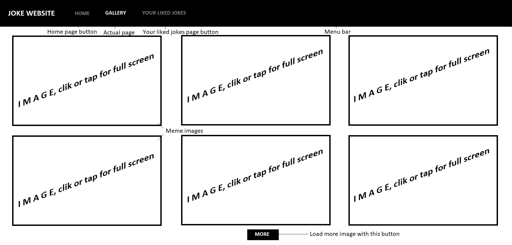

## 1. System goals
The system goal is to provide a website that display jokes that belong to different kind of categories for visitors to binge trough.
* One goal is that visitors should be able to search and filter the jokes based on their categories
* It should be possible to save favourite jokes to the local storage that could be displayed later on the screen
* Filtering not-safe-for-work content should also be possible to achieve a kind of child-friendly website
* A part of the website should display the Joke of the Day, which should stay the same the whole day, but should be generated randomly each day
* The visitors should be able to search jokes by words

## 2. Not system goals
* User registration
* Displaying animations, videos 
* Sending own jokes
* Saving jokes to a MySQL database

## 3. Current situation description
We are a cheerful non-profit organization of party clown web-developers, with a goal in mind to put a smile on the faces of as many people as possible with our projects. In our rushing modern world people tend to get lost in their boring everyday life, so we want to make our visitors' everydays a little brighter. At the moment, no one of our acquaintances have a favorite joke site, and jokes only go the round. 

## 4. Desired system description
We want to give a web appearance to the contents stored in newspapers, comics, Facebook posts and text files. With the constant development of technology, these physical contents (comics, newspaper etc.) slowly start to disappear. Nowadays most people have mobile phones, which has become almost essential to the everyday life. Keeping up with the current technology, we want to brighten your mood if you have boring moments, with a help of just a few clicks or taps on our website. Visitors could spend their time here and creating a good atmosphere for themselves or others. The website has to be easy to access and navigate for every user. If possible, it should have a responsive interface. The website should be easy to maintain. It should be possible to filter the content to make it child-friendly or not. It has to contain a search bar so that people can find jokes for their own preferences.

## 5. Requested business process modell
* Option to add jokes to "Liked jokes", where you can find your favorite content. → Store your favorite content to a local storage
* Categories menu bar. → Filtering by categories
* Search bar. → Search option
* Fresh content every day. → Joke of the day
* The display of the website should be compatible with as many devices as possible. → Responsive display 

## 6. List of requirements
*  R01 Easy to operate
*  R02 Responsive web design
*  R03 Filtering jokes by categories
*  R04 Filterability of harmful content
*  R05 Search engine implementation
*  R06 Storing favorite jokes
*  R07 Meme gallery
*  R08 Picture modal

## 7. Usage instances
In this case the only actors on the website are visitors, who do not necessarily tend to be computer literate which means that the website should be easy to operate and navigate. Since the data comes from a WebAPI it means that administrators don't need to manage the website and its database.

## 8. Compliance - How the usage instances satisfy the requirements
* Main page: After entering the webpage URL, the items displayed on the main screen in the browser are easy to use due to the clean visual design. Due to the responsive web design, the home page also provides easy transparency from tablet or phone
* Categories: In the header, it is possible to switch between categories by selecting the Category button, and this will display various jokes on the home page screen
* Like Button: The Like button allows you to save your favorite jokes to local storage, which can be seen again later when the web page is reopened
* Search Bar implementation allows you to search for jokes by words
* Next to the Search bar, there is a checkbox, which you can filter the jokes based on their offensive nature
* Gallery button is available by pressing meme gallery
* Press the filter button to avoid nsfw content

## 9. Visual Design
Our website build up of 3 pages, all of them get a visual design plan, which were made in paint. 

First of all, the main page:

Got a clean and simple visual design. And have talkative menu buttons, which makes the website easy to operate. Also have a filtering option, a search bar, and we can search after jokes in several categories with the "categories" drop-down menu.

Next page is a gallery:
     
The gallery is even simpler than the home page, here only the pictures are located, and the menu buttons for switching between pages.

Last but not least we have a visual design for the "your liked jokes" page:
     
     
## 10. Scenarios
Opening the website should result in the main screen displaying which should contain the tabs to choose from the categories and the place to display the jokes. On default it should display random jokes. On one side the Joke of the Day should take place, which should not change while navigating on the website.
Options:
* Under the jokes, there should be a button. By clicking on it, a new joke should be queried from the WebAPI.
* Choosing the category results in only displaying the jokes that belong in that category
* A button should be displayed that controls whether the website displays the NSFW content or not
* Saving favourite jokes locally by clicking a button in the joke's displaying box
* By clicking on the "about us" menu item the user will be redirected to a page full of memes
* By clicking on the "your liked jokes" menu item the user will be redirected to a page filled with the jokes the user saved with clicking the box in the corner of the joke

## 11. Function - requirement compliance
The desire for responsive web design that is drawn up in the requirements specification, so far will be fulfilled by the fact that the project will be created using the Bootstrap framework in addition to the html / css structure, which will ensure the responsive properties. Since we are talking about modern web pages, today’s designs almost require simplicity and clarity.That is what we strive for too, as it is seen in the screen design. The black-and-white-pastel color scheme and the clearly visible, distinctive elements ensure easy navigation on the website. The query of the jokes will be executed by a WebAPI, which can be used for free by anyone, so database management problems are out of scope along the way. This WebAPI allows the developer to filter further the retrieved data and it enables to meet with additional requirements in the future. We strive to create the website in a browser-independent way, so despite the usage of different browsers the portal will look the same in every of them.

## 12. Glossary
* [API](https://en.wikipedia.org/wiki/Web_API)
* [Responsive webdesign](https://en.wikipedia.org/wiki/Responsive_web_design)