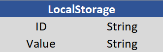

# Simple Joke Site

## 1. System goals
One of our goals regarding the system is to keep it 7/24 available for users to access. The design of the portal is going to be responsive in order to make it possible to use our system, not decreasing in quality, on different size of devices' screen. One of the basic features of the system is the ability to react to users' activity. One of those are clicking and typing in order to fulfill the desire of the user. Other features are the ability to switch between menu items, search between categories and filter the data the user is looking for. Retrieving the jokes are going to happen with the usage of an API. This API generates the jokes randomly so the website displays randomly generated jokes on the main page.

## 2. Not system goals
* Administration of users
* Enable registration
* Enable log in
* Enable user to post content on the site
* Displaying animations and videos on the site
* Subscribing to newsfeed
* Unavailability

## 3. Project plan
First and foremost the most important part of working in a group is dividing responsibility and different kind of tasks fairly and evenly. We are aware that we have different kind of strength when it comes to different parts of development so we strive for equality: two people of our group will be responsible for the visual design of our webpage and two people will be in charge of creating the backend code. It doesn't mean total separation, tasks will be discussed thoroughly when questions arise.

Positions:
 * Anna Egyed - Backend (JavaScript)
 * Adrienn Tuba - Backend (JavaScript)
 * Csaba Szilágyi - Frontend (HTML/CSS)
 * Mátyás Fenyvesi - Frontend (HTML/CSS)

Our schedule is already started:
* We have already discussed the plans and requirement scpecifications beforehand, we cleared up what the aim of the website is. 
* The next step was to create the function specification where we cleared up the functional details of the website and anything that needed clarification.
* The current step is creating a system design where further functional and systemic details should be clarified.
* And the last milestone is the actual programming and testing of the product.

2020. 09. 07. - 2020. 09. 13.
     2020. 09. 07.  - Meeting with the customer and discussiong the specifications and the requirements of the system.
     2020. 09. 11.  - I. Team meeting discussing the new system order.
     2020. 09. 13.  - Deadline of requirement specification.

2020. 09. 14. - 2020. 09. 20.
     2020. 09. 14.  - Meeting with the customer to clarify the requirement specification.
     2020. 09. 15.  - II. Team meeting regarding the functionality of the system.
                    - Start working on the functional specification of the system.
     2020. 09. 18.  - Planning system design.
     2020. 09. 20.  - Deadline of functional specification.
                    - Dealine of system design.
                    - III. Team meeting: discussing the process so far and the next moves.

2020. 09. 21. - 2020. 09. 27.
     2020. 09. 21.  - Meeting with the customer. Clarify functional specification and system design.
     2020. 09. 23.  - Writing the basic skeleton of the system.
                    - IV. Team meeting: Discussion of the frontend of the system.
     2020. 09. 24.  - Deadline of the frontend implementation.
     2020. 09. 25.  - V. Team meeting: Discussion of the backend of the system.
                    - Start implementing the backend of the system.
     2020. 09. 26.  - Deadline of the backend implementation.
                    - Create testing protocol.
     2020. 09. 28.  - Deadline of the system testing. Oversee the whole project.

2020. 09. 28. Meeting with the customer and hand over the system.

## 4. Business process model
 Opening the website results in the home page which gives the visitor the default jokes from any categories and the navigation bar will offer different kind of option to filter the content. 
* Home: The Home button will navigate us back to the default home page where jokes will be displayed randomly unless a category is chosen. Also on the home page the Joke of the Day will be placed which stays the same all day. This is the main part of the website, this is where you can choose your favourite jokes and save them or just have a good laugh on a rainy day.
* Categories: The categories tab will give the opportunity to filter the jokes by chosing one of the possible categories. 
* The Gallery will contain pictures of memes that could also entertain the visitors of this website, since nowadays memes seem to be just as popular as written jokes.
* The Your Liked Jokes tab will give you the opportunity to take a look at your liked jokes so you can always visit the website again and get back your saved items.
* Searchbar: In case you forgot to save a joke or you just look for something particular, there is an option to search for that joke amongst the others by words.

## 5. Requirements
* R01 Easy to operate
* R02 Responsive web design
* R03 Filterability of harmful content
* R04 Search engine implementation
* R05 Chosing jokes by categories
* R06 Ability to store favourite jokes
* R07 Gallery of memes with funny pictures created in .jpeg or .png

## 6. Functional design
Main Page:
* The user after visiting our site's URL will encounter with the main page. 
* Jokes, random generated by the WebAPI are listed here and displayed, regardless of any category.
* Joke of the day is showed on the main page. It is always regenerated after 24 hours.

* Display:
     Jokes have own rectangle boxes with a colored header and a box for signing whether the user liked
     the joke or not.

Menu bar:
In the menu bar, the menu items are buttons with the ability to redirect the user to another pages.
* Category button: Clicking this button the user will open a drop-down menu of categories the user could chose from.
* Gallery button: Clicking this button the user will be redirected to a page filled with meme pictures.
* Your liked jokes button: Clicking this button the user will be redirected to a page filled with his  favorite jokes.The jokes are saved here after the user tick the little boxes signed by the text "like".

Filter box:
* Ticking this box makes possible for the users to filter the content depending on the audience (child/adult).

Search bar:
* The users are able to type here the content what they are looking for.

More button:
* Clicking this button the user is able to generate more jokes to the main page.

Your liked jokes page:
* Here the user find the jokes which personally liked before. The users are able to rewind the jokes which they liked and with the "More" button they are able to load more jokes. The users are able to go back to the main page or visit the gallery to look for memes.

Gallery page:
* Here the users find famous memes. Using the "More" button they are able to load more memes. They are able to go back to the main page or visit the personally liked jokes.

## 7. Physical environment

**Purchased software components and external systems:** The only external system we use is the [RapidAPI's](http://rapidapi.com/) [JokeAPIv2](https://sv443.net/jokeapi/v2/#joke-type) which is a RESTful API that serves the jokes. It can be used freely.

**Frontend:**
* Visual Studio Code - HTML and CSS, offers a great deal of different kind of tools and extensions
* Sublime Text 

**Backend**
* Visual Studio Code - Extensions for JavaScript (ES6), Live Server

**Other Environments**
* Mozilla - Web Browser
* Google Chrome - Web Browser
* Safari - Mac OS X web browser

## 8. Abstract domain model
* Domain specification, concepts
* Abstract components and their relationship

## 9. Architectural design
**Main Components of the design**

**Front End**
* Web Browser
* Mobile Browser
* The User Interface, the visual design will take place at this front

**Middle**
* Application server
* Web server

**Back End**
* REST API

The Website will follow the client-server model which means that different kind of clients can run at the same time and the server will be able to process their requests. It requires Internet access.

## 10. Database design
This application doesn't use MySQL or anything that could be considered traditional database. It retrieves its data from a WebAPI and works with its content and saves the liked jokes to a local storage that is a readonly property of the document, in this case browser, visitors open the webpage. So everyone can save in and read from it locally without maintaining a database.

The API doesn't directly send data though, it works with promises that sends arrays with different kind of informations. A typical response from the API looks like this: 

    {joke: {…}}
    joke:
        category: "Programming"
        error: false
        flags: {nsfw: false, religious: false, political: false, racist: false, sexist: false}
        id: 2
        joke: "A guy walks into a bar and asks for 1.4 root beers.↵The bartender says "I'll have to charge you extra, that's a root beer float".↵The guy says "In that case, better make it a double.""
        lang: "en"
        type: "single"
        __proto__: Object
     __proto__: Object

According to the URL the fetch request uses, filtering is possible on the available data by blocking out flags or choosing categories.

Saving the data will use the localStorage gives an oppotunity to save a string with an ID to retrieve it later. The ID can be anything, it will treat is as a string. The actual value can be anything: the magic of modern technology and JavaScript can achieve the power of saving even an array or an object. In our case a simple string will be enough.

## 11. Implementation design:
* Presistence classes (dao.js, util.js)
* Business logic classes (uicontroller.js, app.js)
* Client-side classes (html/css - homepage.html, gallery.html, favjokes.html)

## 12. Test design
The reason we need test design is noone can write perfect programs, so we need to test for the bugs and correct it. There are several ways we can test a program:
* Black-box(Tests are based on specification)
* White-box(Tests are based on source code)
* Grey-box(Test are based on part of the source code)

The offered test is black-box test, because it needs to be tested for the following features:
* Every button is working its specified way(click test)
* Every link on the site goes to the correct site
* Every picture on the site appears correctly
* By resizing the page every element appears where it should be
* Testing on laptop/pc
* Testing on phone/tablet
* Search bar works correctly
* Check box works correctly
* Liked jokes are being saved
* Joke of the Day generated everyday
* Categories drop menu works correctly

After these tests we should give it to friends / acquaintances to test the page because we would be biased about the result and thus the final result of the test would not be appropriate.

## 13. Installation design
* Have an electrical device that is functional and capable of accessing the Internet (mobile, PC, etc..)
* If don't have an operating system, then need to install any of them. (Windows, Ubuntu, etc..)
* Internet access
* Download/install any web browser
* Type the URL of the page in the title bar

## 14. Maintenance design
With the constant development of informatics, we want to keep ourselves up-to-date with technologies, and thus we consider it important to maintain our website.

List of maintenance tasks:
* Bug fixes
* Improving user experience based on feedback
* Full operation of website functions
* Add, create, delete pages as required
* Avoid website downtime