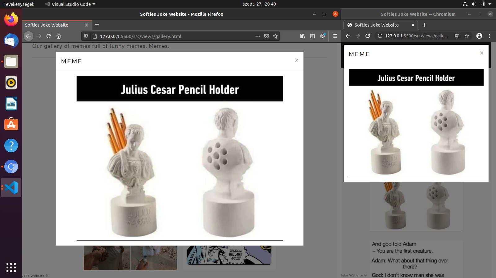
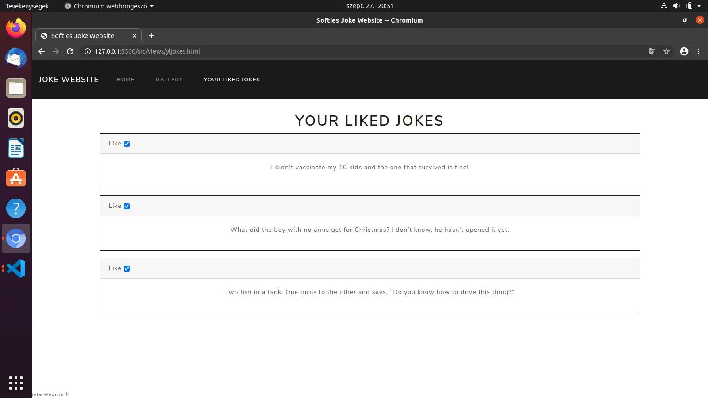

# Operating System: Ubuntu
# Browser name: Chromium, Firefox

* Test 1:
    1. Home button on navigation bar press
    2. Expected: Navigate to HTML page
    3. Result: Navigated to HTML page

* Test 2:
    1. Checkbox click
    2. Exprected: Box filled, unfilled
    3. Result: Box worked properly

* Test 3:
    1. Responsivity works by changing browser size
    2. Expected: Elements go to the right position
    3. Result: Screenshot

* Test 4:
    1. Gallery button on navigation bar press
    2. Expected: Navigate to Gallery page
    3. Result: Navigated to Gallery page

* Test 5:
    1. Your Liked Jokes checkbox
    2. Expected: Liked jokes are saved
    3. Result: Screenshot

* Test 6:
    1. Unliked jokes
    2. Expected: Unliked jokes are deleted from Your liked Jokes
    3. Result: Unliking works well

* Test 7:
    1. Search bar test
    2. Expected: Searching works
    3. Result: Searching works well

* Test 8:
    1. Random joke generation
    2. Expected: Click to home button or navigate to home site, new jokes are generated
    3. Result: New jokes are generated

* Test 9:
    1. More button click for loading more joke
    2. Expected: More jokes are loaded
    3. Result: More jokes are loaded

* Test 10:
    1. Meme of the day
    2. Expected: Everyday generates new memes
    3. Result: Modifying the date, new meme generated