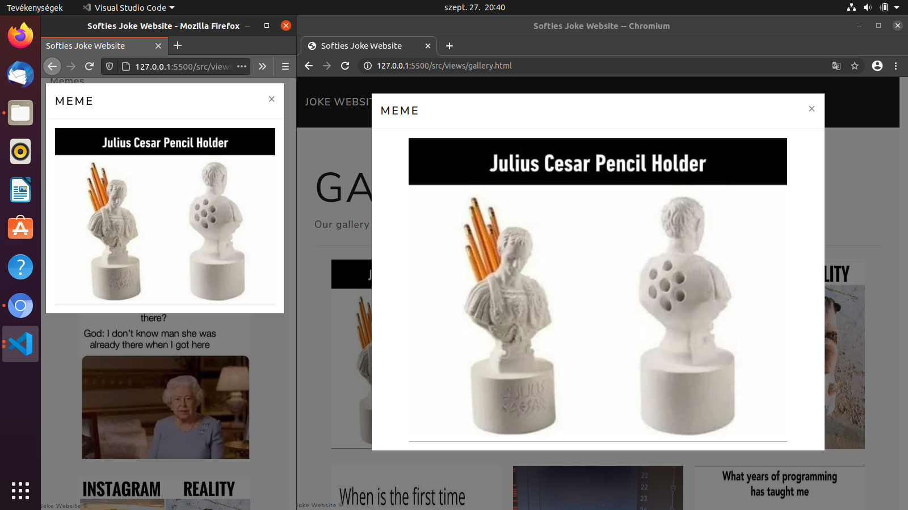
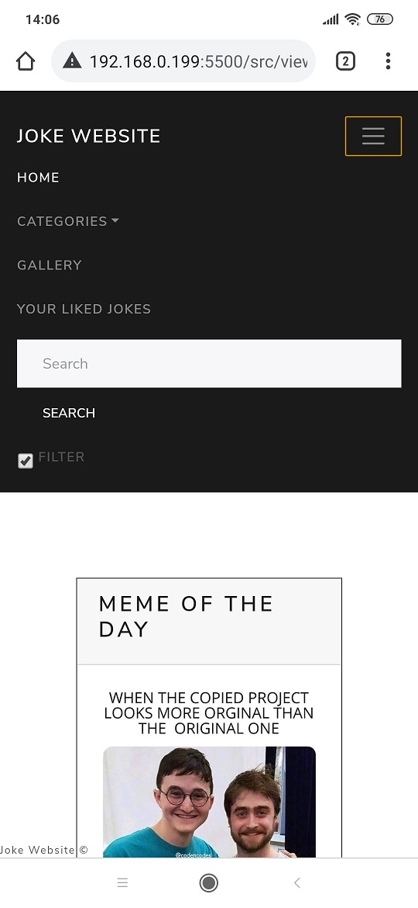
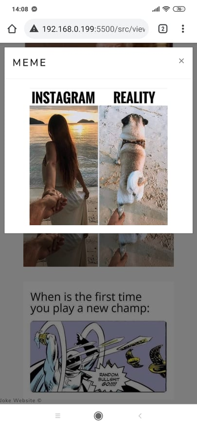
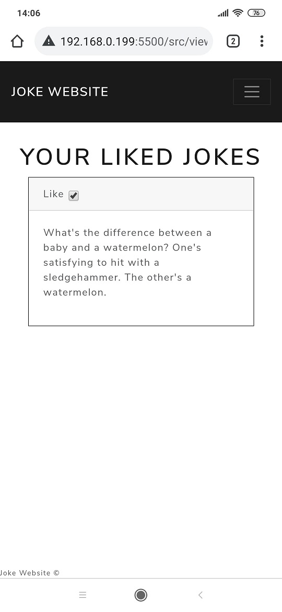

# Operating System: Ubuntu
# Browser name: Chromium, Firefox

* Test 1:
    1. Home button on navigation bar press
    2. Expected: Navigate to HTML page
    3. Result: Navigated to HTML page

* Test 2:
    1. Checkbox click
    2. Exprected: Box filled, unfilled
    3. Result: Box worked properly

* Test 3:
    1. Responsivity works by changing browser size
    2. Expected: Elements go to the right position
    3. Result: Screenshot

* Test 4:
    1. Gallery button on navigation bar press
    2. Expected: Navigate to Gallery page
    3. Result: Navigated to Gallery page

* Test 5:
    1. Your Liked Jokes checkbox
    2. Expected: Liked jokes are saved
    3. Result: Screenshot

* Test 6:
    1. Unliked jokes
    2. Expected: Unliked jokes are deleted from Your liked Jokes
    3. Result: Unliking works well

* Test 7:
    1. Search bar test
    2. Expected: Searching works
    3. Result: Searching works well

* Test 8:
    1. Random joke generation
    2. Expected: Click to home button or navigate to home site, new jokes are generated
    3. Result: New jokes are generated

* Test 9:
    1. More button click for loading more joke
    2. Expected: More jokes are loaded
    3. Result: More jokes are loaded

* Test 10:
    1. Meme of the day
    2. Expected: Everyday generates new memes
    3. Result: Modifying the date, new meme generated

Tested By: Mátyás Fenyvesi, 2020.09.27.

# Operating System: Windows
# Browser name: Google Chrome, Firefox, Opera, Edge
## Devices: Laptop, PC

* Test 0:
    - Page display
    - Expected: Pages looks like as in system design.
    - Result: Every page looks like as in a system design one.

* Test 1:
    - Home button on navigation bar press:
    - Expected: Navigate to home page
    - Result: Navigated to home page

* Test 2:
    - Checkbox click:
    - Exprected: Box filled (or unfilled, if it was filled before)
    - Result: Box worked properly

* Test 3:
    - Responsivity works by changing browser size:
    - Expected: Elements go to the right position
    - Result: Work correctly (screenshot)

* Test 4:
    - Gallery button on navigation bar press:
    - Expected: Navigate to Gallery page and mark as active page (with white highlight).
    - Result: Navigated to Gallery page. Higliht stay on home inscription!
    - Fixed highlight error, with 0.5 bugfix!
    - After bugfix result: Navigated to Gallery page and marked as active page.
 
* Test 4.1:
    - Your liked jokes button on navigation bar press:
    - Expected: Navigate to Your liked jokes page and mark as active page(with white highlight).
    - Result: Navigated to Your liked jokes page. But higliht stay on home inscription!
    - Fixed highlight error, with 0.5 bugfix!
    - After bugfix result: Navigated to Your liked jokes and active page highlight was working well.

* Test 5:
    - Your Liked Jokes checkbox:
    - Expected: Liked jokes are saved
    - Result: Jokes are saved (screenshot)

* Test 6:
    - Unliked jokes:
    - Expected: Unliked jokes are deleted from Your liked Jokes after a refresh or page switch.
    - Result: Unliking works well.

* Test 7:
    - Search bar test:
    - Expected: Searching works.
    - Result: Searching works well.

* Test 8:
    - Random joke generation:
    - Expected: Click to home button or navigate to home site, new jokes are generated
    - Result: New jokes are generated

* Test 9:
    - More button click for loading more joke:
    - Expected: More jokes are loaded.
    - Result: More jokes were loaded.

* Test 10:
    - Meme of the day:
    - Expected: Everyday generates new memes.
    - Result: New meme generated everyday.

Tested By: Csaba Szilágyi, 2020.09.27.

# Operating System: Android
# Browser name: Google Chrome
## Devices: Mobile

* Test 1:
    - Menu button press:
    - Expected: Drop-down list showed up, where we can find menu bar buttons for every page and we can navigate between them.
    - Result: Menu bar buttons were showed up, and working (Screenshot)

* Test 2:
    - Checkbox click:
    - Exprected: Box filled (or unfilled, if it was filled before)
    - Result: Box works well

* Test 3:
    - Responsivity works by changing browser size (and fit for mobile):
    - Expected: Elements go to the right position
    - Result: Work correctly, and good on mobile.

* Test 4:
    - Image full screen in gallery on mobile:
    - Expected: Vertical full screen is work.
    - Result: It is work. (Screenshot)

* Test 5:
    - Your Liked Jokes checkbox:
    - Expected: Liked jokes are saved
    - Result: Jokes are saved (screenshot)

* Test 6:
    - Unliked jokes:
    - Expected: Unliked jokes are deleted from Your liked Jokes after a refresh or page switch.
    - Result: Deleting works well.

* Test 7:
    - Search bar test:
    - Expected: Can we search.
    - Result: Searching works.

* Test 8:
    - Random joke generation:
    - Expected: Click to home button or navigate to home site, new jokes are generated
    - Result: New jokes are generated everytime.

* Test 9:
    - More button click for loading more joke:
    - Expected: Another jokes are loaded.
    - Result: More jokes were loaded.

* Test 10:
    - Meme of the day:
    - Expected: Everyday generates new memes.
    - Result: New meme generated everyday.

Tested By: Csaba Szilágyi and Adrienn Tuba, 2020.09.27.

